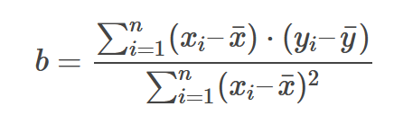
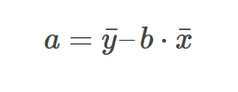
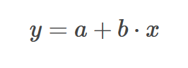
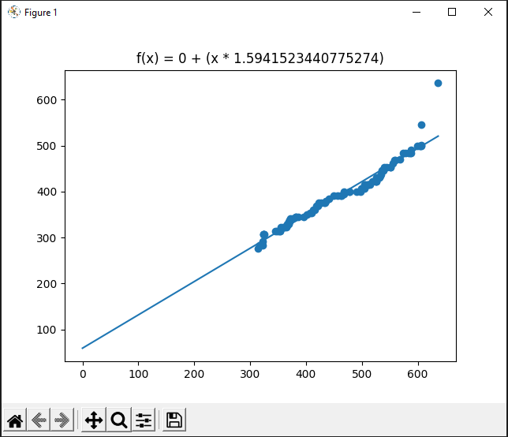

LRD

-------------------------

   <a style="color: #FFF; width: 100%; background-color: #221; margin-top: 10px; padding-right: 42px" href="https://github.com/jannikwiessler/pythonDHBW/blob/main/Lineare_Regression/Lineare_Regression_py.pptx">Erklärung des LRD</a> 
   <a style="20px; color: #FFF; width:100%; background-color: #221; margin-top: 10px;" href="https://www.crashkurs-statistik.de/einfache-lineare-regression/">Erklärung der Formeln</a>

    </img>
    </img>
    </img>

-------------------------

</img>