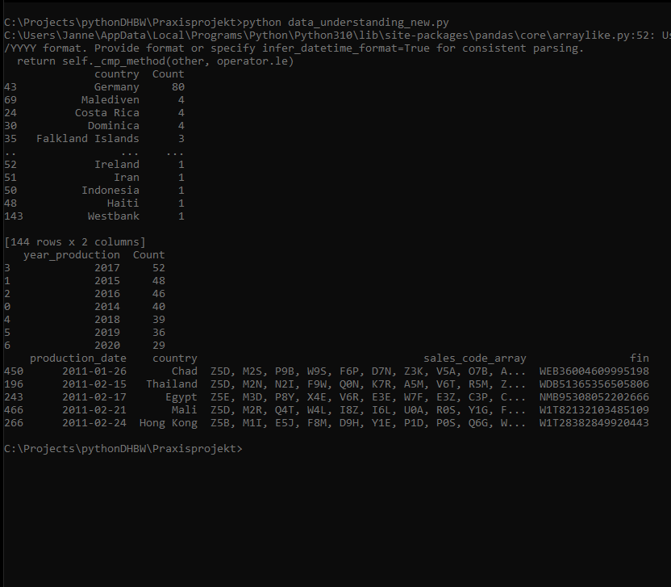
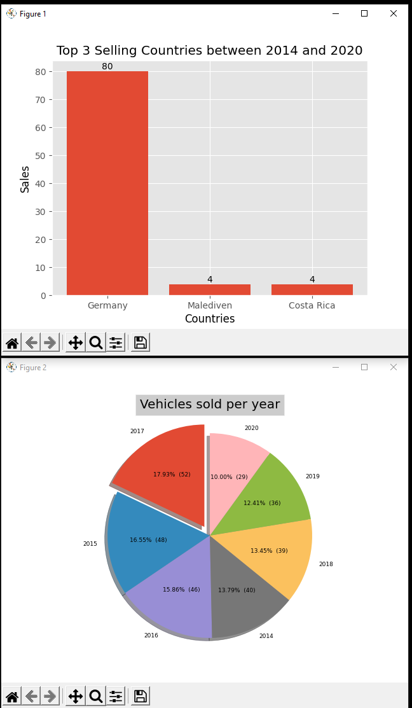
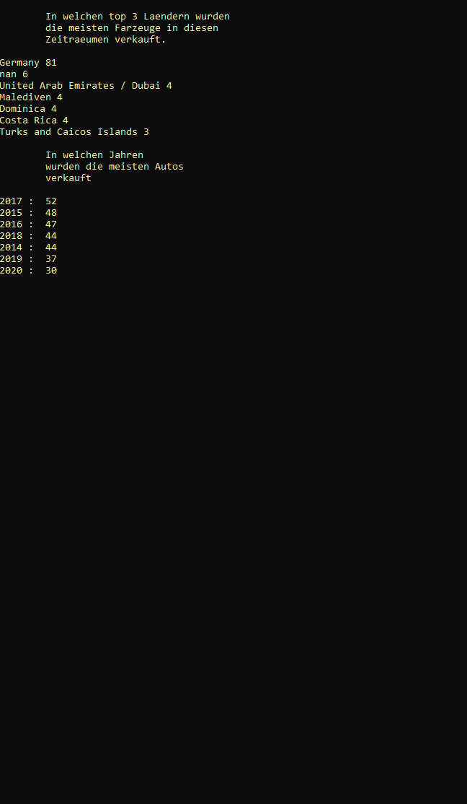
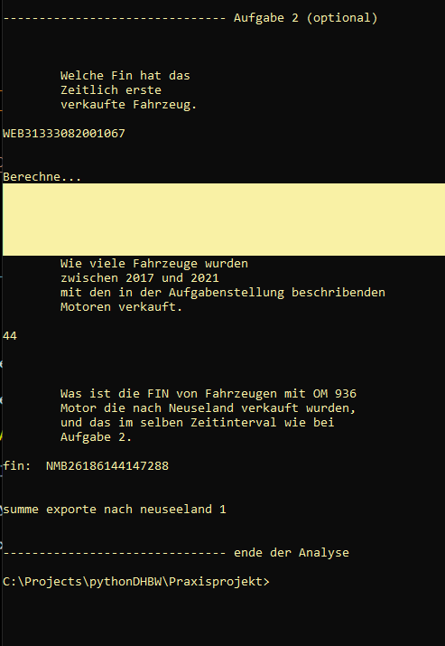

<u><h1>Python DHBW Projekt</h1></u>

-------------------------

Max Muckenhirn

Janne Sickert

Fabian Bee

Loan Daniel

-------------------------

<h1><b>
<a href="https://github.com/JanneSickert/pythonDHBW/tree/main/Praxisprojekt">
Praxisprojekt Code</a></b></h1>
<h1><b><a href="https://github.com/JanneSickert/LRD">
Repository für LRD</a></b></h1>

-----------------------

<b><h2>Praxisprojekt</h2></b>
<h2>Aufgabe 1: Data Engineering</h2>

 

------------------------

 

<h2>Aufgabe 2: Data Science</h2>

<table width="100%" bordercolor="#000000" bgcolor="#010201" cellspacing="2">
    <tr>
        <td>Graph</td>
        <td>Kontrolle</td>
    </tr>
    <tr>
        <td></td>
        <td></td>
    </tr>
</table>

 

------------------------

 

<h2>Aufgabe 2: Data Science (optional)</h2>

 

------------------------

